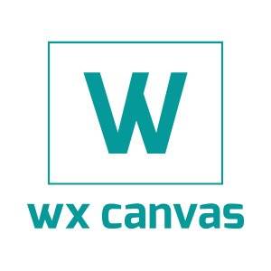
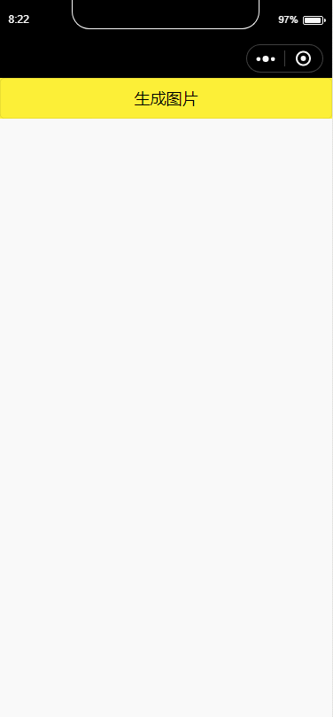

<p align="center">
    <a href="https://github.com/Mrminfive/wxapp-canvas" rel="noopener noreferrer"></a>
</p>
<p align="center">
    <a href="https://npmcharts.com/compare/wxapp-canvas?minimal=true"></a>
    <a href="https://www.npmjs.com/package/wxapp-canvas"></a>
    <a href="https://www.npmjs.com/package/wxapp-canvas"></a>
</p>

<h3 align="center">wxapp-canvas</h3>

<h3 align="center">🎨 微信小程序快速绘画工具</h3>

## 简介

项目使用样式表来绘制 canvas，利用 wxss 下 rpx 单位实现适配，既能保证开发效率，同时也没有学习成本。

组件实现了 css 基本盒子模型，涵盖宽高、背景、字体、边框、内边距等，支持 **自适应宽高**、**文本换行**、**圆角边框**、**背景渐变**、**背景重复** 等好玩功能，感兴趣的可以了解下。

绘制代码没有与组件抽离，有兴趣的同学可以试试抽离去适配多终端玩玩。



> 注意：项目使用 `canvasContext.measureText`、`nodesRef.fields[computedStyle]` 等，请保持基础库 >= 2.1.0

## 快速开始

### 使用之前

在开始使用 wxapp-canvas 之前，请阅读 [微信小程序自定义组件][wx-doc] 的相关文档。

### 如何使用

以原生小程序为例：

1. 安装 npm 依赖。

    ``` shell
    npm install --save wxapp-canvas
    ```

    或着将依赖下的 `dist` 目录下的文件拷贝到自己的项目中，建议放置在 `packages/wxapp-canvas` 目录下，组件路径根据自己项目位置配置。

    ``` shell
    ├─packages
    │  └─wxapp-canvas
    │      ├─babel-runtime
    │      │  └─helpers
    │      ├─behaviors
    │      │  └─element
    │      └─components
    │          ├─wxapp-canvas
    │          └─wxapp-canvas-div
    └─pages
        └─index
    ```

2. 添加页面的 json 配置（手动拷贝文件时请注意引用路径）

    ``` json
    "usingComponents": {
        "wxapp-canvas": "wxapp-canvas/components/wxapp-canvas/index",
        "wxapp-canvas-div": "wxapp-canvas/components/wxapp-canvas-div/index"
    }
    ```


3. 在 wxml 中使用组件

    ``` html
    <wxapp-canvas id="wxapp-canvas" class-name="m-wxapp-canvas">
        <wxapp-canvas-div class-name="m-wxapp-canvas-div" csstext="content: '这是节点的内容'; background-color: red;"></wxapp-canvas-div>
    </wxapp-canvas>
    ```
    
    * wxapp-canvas： 
        * `class-name`: 外部样式类，用来代替 `class`
        * `preload`: 配置是否预加载资源
    * wxapp-canvas-div:
        * `class-name`: 外部样式类，用来代替 `class`
        * `csstext`: 外部样式，用来代替 `style`

4. 在 wxss 中编写相应样式

    ``` css
    .m-wxapp-canvas {
        width: 100vw;
        height: 50vh;
    }

    .m-wxapp-canvas-div {
        position: absolute;
        bottom: 20rpx;
        right: 20rpx;
        width: 50%;
        height: 50%;
        border: 10rpx solid;
        border-top-color: red;
        border-right-color: blue;
        border-bottom-color: green;
        border-left-color: yellow;
    }
    ```

    与标准样式层叠表一致，支持基本盒子模型，包括：

    * dimension: 支持宽高自适应、最大最小宽高
    * border：支持基本边框、圆角、阴影
    * background：支持背景颜色、图片、线性渐变、repeat、大小
    * color：兼容标准样式表
    * font：兼容标准样式表
    * padding：兼容标准样式表
    * positioning：支持 top、left、bottom、right、z-index
    * text: 支持 text-align、vertical-align 用于节点内容位置的调节

    与标准盒模型不一致的有：

    * position 仅支持 `absolute`
    * 不支持 display
    * 不支持嵌套节点
    * 在有阴影及边框的情况，背景将无法实现透明
    * 渐变背景请以 `linear-gradient(<角度>, [<颜色> <位置>])` 的标准方式书写，如：`linear-gradient(30deg, #fff 0%, #000 100%)`

5. 在 js 中执行渲染

    ``` js
    Page({
        myMethod() {
            wx.showLoading({ title: '绘制中' });
            const canvas = this.selectComponent('#wxapp-canvas');
            canvas
                .draw()
                .then(() => {
                    wx.hideLoading();
                    // 执行自定义操作，如保存为图片

                    canvas.getContext().anvasToTempFilePath(...)
                });
        }
    });
    ```

    组件对外暴露以下方法：

    * `draw`：绘制面板
         * @return {Promise}
    * `getContext`：导出画板上下文
         * @return {Object} canvas 上下文
    * `adaptationText`：适配文本
         * @param {String} str 需要适配的文本
         * @param {Object} font 文本样式
         * @param {Number} maxWidth 最大容器宽度
         * @return {Array} 分段好的文本

## 自定义扩展

wxapp-canvas 允许用户扩展自定义渲染节点。

### 一个栗子

一个基本的自定义渲染节点结构如下：

1. wxml 内容
    ``` html
    <!-- 自定义节点需要设置一个空 view -->
    <view id="canvas-element" class="class-name" style="display: none;"></view>
    ```

2. js 脚本内容
    ``` js
    import { behaviors } from 'wxapp-canvas/index.js';

    Component({
        externalClasses: ['class-name'],

        behaviors: [
            behaviors.element
        ],

        relations: {
            'element': {
                type: 'ancestor',
                target: behaviors.wxappCanvasBehavior,
                linked(target) {
                    this.$canvas = target;
                }
            }
        },

        methods: {
            /**
             * 用于自定义渲染内容
             */
            render(ctx) {
                // do some thing
            },

            /**
             * 用于预加载资源
             *
             * @return {Promise}
             */
            preload(rect, utils) {
                return this._preload(rect, utils)
                    .then(() => {
                        // do some thing
                    });
            }
        }
    });
    ```

### 栗子说明

组件提供 `behaviors.element` 和 `behaviors.wxappCanvasBehavior` 两个 behavior，一个代表节点一个代表容器，任何自定义节点均需像上文例子一样集成 behaviors。

自定义组件还需配置外部样式类，以保证对外规格的统一。

自定义组件有两个必需的方法：`render` 和 `preload`：

* `render`：接收 canvas 上下文，执行自定义绘画动作
* `preload`: 资源预加载，接收容器 `boundingClientRect` 及适配工具脚本，该方法必须调用 `_preload` 解析样式方法及返回 Promise 函数。

## 预览组件

clone 项目，安装以来，用微信开发者工具打开项目下的 example（注意替换项目的 appid）：

``` shell
# clone 项目
git clone https://github.com/Mrminfive/wxapp-canvas.git

# 安装依赖
cd wxapp-canvas && npm install

# 编译组件
npm run dev
```

## License

[MIT](./LICENSE)

Copyright (c) 2018 minfive

[wx-doc]: https://developers.weixin.qq.com/miniprogram/dev/framework/custom-component/
